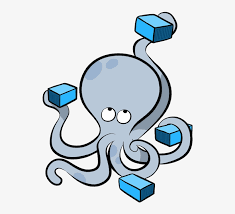
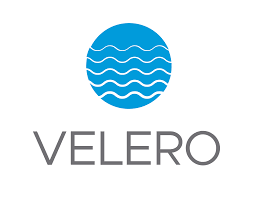
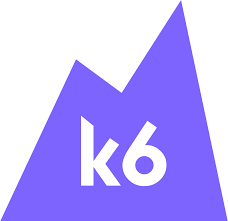
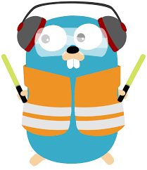

<h1 align="center">🤠 Howdy! I'm Mouaad ELMASLOUHY 👋</h1>

- 🔭 Working as DevOps and Cloud Engineer
- 💻 Currently learning more about DevOps and Cloud
- 👨‍🎓 5 years' of computer science engineering education with Big Data and Cloud Computing Engineer diploma 
- 📘 I write about Programming & Tech in Medium (interesting topics !)
- 📫 Where to find me: 

### Currently working with:

 

### Currently Learning :

 

### Studied and have projects by some:

 
